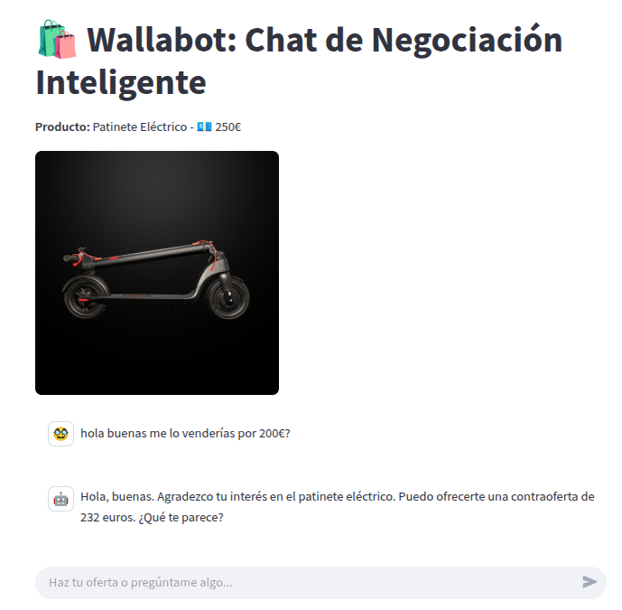
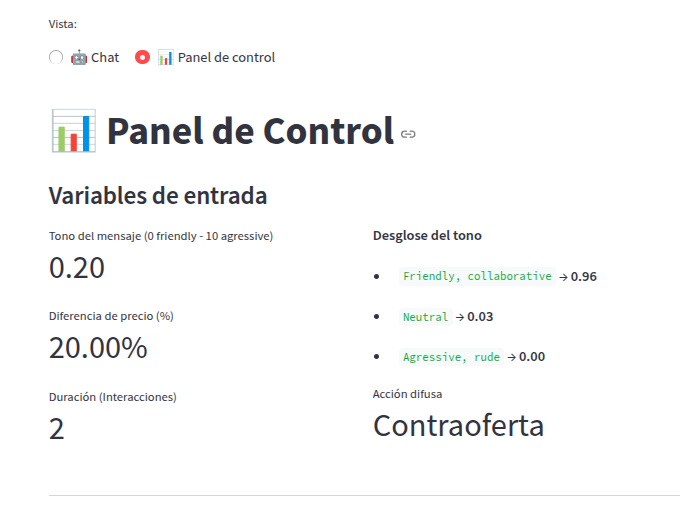
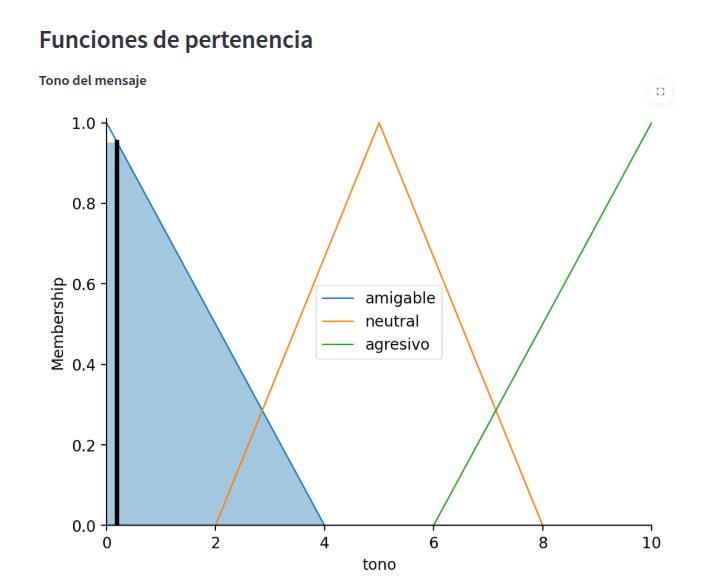

# Wallabot

A chatbot expert in second-hand item price negotiation based on fuzzy logic.

This project is a proof of concept designed for a class assigment for the IDIF subject (Modelling with uncertainity, Fuzzy Logic and Soft Computing) within the [TECI Master degree](https://blogs.mat.ucm.es/teci/) from the Polytechnic University of Madrid and the Complutense University of Madrid. 

> [!IMPORTANT]
> **Legal Disclaimer:** This project is purely academic and educational. Wallabot is not affiliated with, sponsored by, or related to Wallapop S.L. in any way.

> [!NOTE]
> Although the documentation and code are in English, the interface and prompts are written in Spanish since this was the language for the lecture. Sorry for the inconvenience!


<p align="center">
  
  <br>
  <em>Chatbot UI</em>
</p>

<p align="center">
  
  
  <br>
  <em>Control Panel: Main Control Panel (left) and Membership Function (right)</em>
</p>


## Set Up

1. Create a ``.env`` file following the structure in ``example.env`` and add your OpenAI API token. If you don't have one you can easily create one [here](https://developers.openai.com/api/docs/quickstart).

2. Run the app with ``uv``:
```bash
uv run streamlit run main.py
```
3. Access the app in http://localhost:8501 and enjoy the haggling! 🥸$$.

## How it Works: Fuzzy Logic System

The chatbot's behavior is controlled by a fuzzy inference system.

### Fuzzy Inputs
* **Conversation Duration:** The total number of user-bot interactions.
* **User's Tone:** (Friendly, Neutral, or Aggressive). I used the [bart-large-mnli](https://huggingface.co/facebook/bart-large-mnli) zero-shot classification model to determine the probability distribution of the three classes. The tone score is then calculated as:
    $$Tone = 0 \cdot P(\text{"Friendly"}) + 5 \cdot P(\text{"Neutral"}) + 10 \cdot P(\text{"Aggressive"})$$

  0 indicates a friendly tone, while values closer to 10 represent higher aggression.
* **Price difference:** User's price offer is extracted from the user's message using regular expressions and then compared to the original price to calculate the relative difference (%).
### Fuzzy Outputs
The output is the **Degree of Acceptance**. Depending on this degree, a specific strategy is selected and injected into the system prompt:

* **Very High:** Accept offer.
* **High:** Make a counteroffer.
* **Low:** Maintain the current price.
* **Very Low:** Reject the offer and end the negotiation.

### Rules
The rules were defined following well-known negotiation principles (inspired by works like Dale Carnegie's *How to Win Friends and Influence People*), such as *"Never reward aggression with concessions"* and *"Prioritize good faith and mutual benefit"*. The following table displays the 17 rules that define the chatbot's decision making:

| Buyer's Tone | Relative Price Difference | Negotiation Duration | Action |
|:---:|:---:|:---:|:---:|
| Friendly | Low | Short | Accept |
| Friendly | Low | Medium | Accept |
| Friendly | Low | Long | Counteroffer |
| Friendly | Medium | Short | Counteroffer |
| Friendly | Medium | Medium | Counteroffer |
| Friendly | Medium | Long | Maintain |
| Friendly | High | Short | Counteroffer |
| Friendly | High | Medium | Maintain |
| Friendly | High | Long | Reject |
| Neutral | Low | Short | Accept |
| Neutral | Low | Medium | Accept |
| Neutral | Low | Long | Counteroffer |
| Neutral | Medium | Short | Counteroffer |
| Neutral | Medium | Medium | Maintain |
| Neutral | Medium | Long | Maintain |
| Neutral | High | Short | Maintain |
| Neutral | High | Medium | Maintain |
| Neutral | High | Long | Maintain |
| Aggressive | Low | Short | Maintain |
| Aggressive | Low | Medium | Maintain |
| Aggressive | Low | Long | Reject |
| Aggressive | Medium | Short | Maintain |
| Aggressive | Medium | Medium | Maintain |
| Aggressive | Medium | Long | Reject |
| Aggressive | High | Short | Reject |
| Aggressive | High | Medium | Reject |
| Aggressive | High | Long | Reject |
